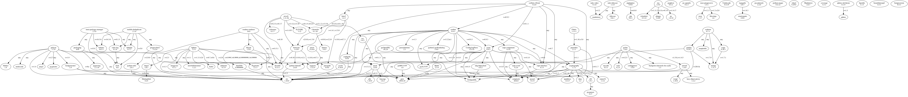

Installation
============

This package is `available on PyPi <https://pypi.python.org/pypi/chessboard>`_,
so you can install the latest stable release and its dependencies with a simple
``pip`` call:

.. code-block:: shell-session

    $ pip install chessboard

See also `pip installation instructions
<https://pip.pypa.io/en/stable/installing/>`_.

Dependencies
------------

FYI, here is a graph of package dependencies:

